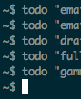

Command line productivity tools that use notifiers

```sh
timer -- ergonomic or productivity timer (e.g., pomodoro technique)
todo -- post todos (that may be sticky)
```

Are these for you?


For clarity, the tools rely on wrapping a CLI notifier. Currently only
[growlnotify](http://growl.info/downloads) is supported[^old].
But, pull requests are welcome.

[^old]: yes, my development environment is frighteningly old

## Install

```sh
$ git clone https://github.com/ashander/notify-tools.git
$ cd notify-tools
$ pip install .
```

Note: this will install commands `timer` and `todo` to your `/usr/local/bin/`!
If you are using these names, you could edit setup.py to change the
install locations.

## Usage

start a timer with default settings:

```sh
$ timer 
```
view other settings
```sh
$ timer --help
```

put up a todo item
```sh
$ todo 'make a thing'
```

## Details

`todo` in action:

From the command line



put stickied todos in top right


## Implementation details

As mentioned, the tools rely on wrapping CLI interface to a notifier. The nice
CLI interface is made possible by [click](http://click.pocoo.org/4/).
